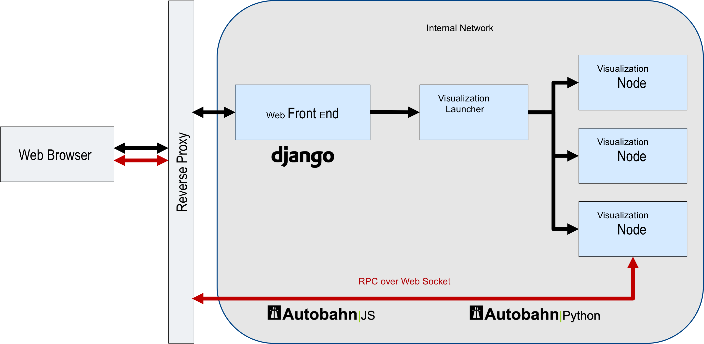

---
title: CDATWeb
layout: default
---------------

  <h1>CDATWeb</h1>
  

    CDAT is an integrated framework that provides an end-to-end solution for management, analysis, and visualization of ultrascale data sets generated for current and future DOE climate data repositories and for the climate science community at large.     
  

  

    CDAT is based on a client-server architecture and is integrated within the Earth System Grid Federation (ESGF) framework, allowing CDAT to take advantage of the advanced data management mechanisms of ESGF.
    In this way, CDAT provides regridding, reprojection, and aggregation tools directly as a component of the ESGF data node, eliminating or substantially decreasing data 
    movement. The CDAT server provides a turnkey application for building complex data analysis and visualization workflows by interacting with one or more CDAT backend servers. These workflows may use predefined components for data transformation and analysis, data collection from disparate data sources outside ESGF, visualization, and user-defined processing steps. Extended provenance information can be captured on the backend server for sharing and collaboration. 
 

<table>
<tr><td width="300px" valign="top">
  

  <ul>
    <li><h3>Alpha Nodes</h3></li>
      <ul>
        <li> <a href="http://cdatweb-devel.llnl.gov">LLNL</a> </li>
        <li> <a href="http://acme-cdatweb.ornl.gov">ORNL</a> </li>
      </ul>

      <li><h3>Press</h3></li>
      <ul>
        <li> <a href="pdf/ACME_CDATWEB_v6.pdf">ACME CDATWeb Poster</a> </li>
      </ul>
      <li><h3>GitHub</h3></li>
      <ul>
        <li> <a href="https://github.com/CDAT/cdatweb/wiki/Roadmap-to-Release">RoadMap</a> </li>
        <li> <a href="https://github.com/CDAT/cdatweb/wiki">Wiki</a> </li>
        <li> <a href="https://github.com/CDAT/cdatweb">Repo</a> </li>
        <li> <a href="https://github.com/CDAT/cdatweb/issues">Issues</a> </li>
      </ul>
    </ul>
  

  </td><td>
  

    
    

</td></tr>
</table>
